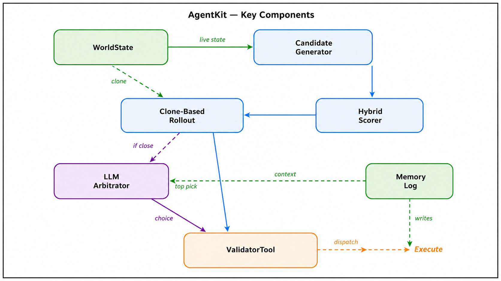
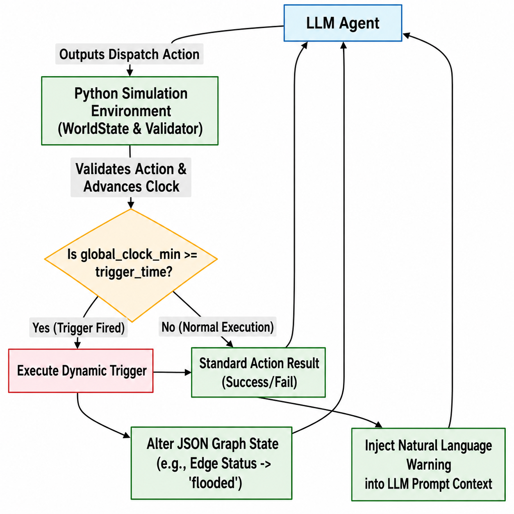

# RescueBench Agent Package

This package contains the active modular implementation used to run RescueBench
experiments.

The figure below summarizes the main components of the modular `agentkit`
implementation.



## Main Components

- [`benchmark.py`](./benchmark.py): benchmark orchestration
- [`cli.py`](./cli.py): command-line runner
- [`scenarios.py`](./scenarios.py): scenario loading and normalization
- [`world.py`](./world.py): world-state simulation
- [`tools.py`](./tools.py): agent-facing tool and validation layer
- [`metrics.py`](./metrics.py): scoring logic
- [`modes/`](./modes): baseline execution modes
- [`agents/`](./agents): custom `agentkit` implementation
- [`docs/`](./docs): implementation notes and comparisons

## Supported Modes

- `deterministic`: greedy baseline
- `zero_shot`: one-shot LLM plan generation
- `react`: tool-using LLM baseline
- `ablated`: ReAct baseline without validator enforcement
- `agentkit`: modular hybrid agent

## Running The Package

From the repository root:

```bash
python3 -m rescuebench_agent --mode deterministic --tier all --runs 1
python3 -m rescuebench_agent --mode agentkit --tier all --runs 1
python3 -m rescuebench_agent --mode zero_shot --tier 3 --runs 1 --provider anthropic
```

## Provider Requirements

LLM-backed modes require an API key:

- `ANTHROPIC_API_KEY` for `--provider anthropic`
- `GEMINI_API_KEY` for `--provider gemini`

If no key is provided, deterministic mode still runs.

## Output

Aggregated results are written to:

- [`benchmark_results.json`](./benchmark_results.json)

The file is overwritten by the most recent benchmark run.

## Reproducing Results

Typical reproductions:

```bash
python3 -m rescuebench_agent --mode deterministic --tier all --runs 3
python3 -m rescuebench_agent --mode agentkit --tier all --runs 3 --provider anthropic
python3 -m rescuebench_agent --mode zero_shot --tier all --runs 1 --provider anthropic
```

## Dynamic Replanning Example

The figure below highlights the dynamic replanning loop used in the more
disruption-heavy RescueBench scenarios.



## Additional Notes

Implementation notes and historical comparisons live in:

- [`docs/REFACTOR_JUSTIFICATION.md`](./docs/REFACTOR_JUSTIFICATION.md)
- [`docs/AGENT_UPGRADE_TRACKER.md`](./docs/AGENT_UPGRADE_TRACKER.md)
- [`docs/LATEST_AGENT_VS_OLD_AGENT.md`](./docs/LATEST_AGENT_VS_OLD_AGENT.md)
